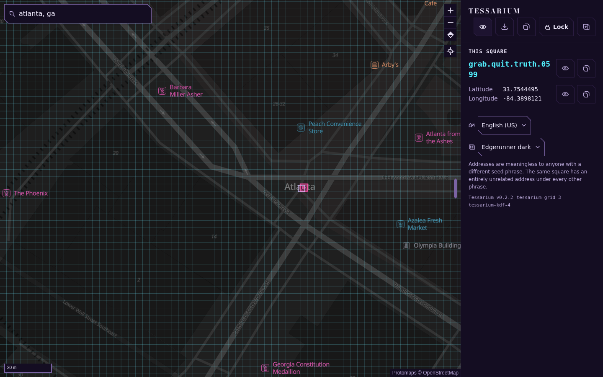
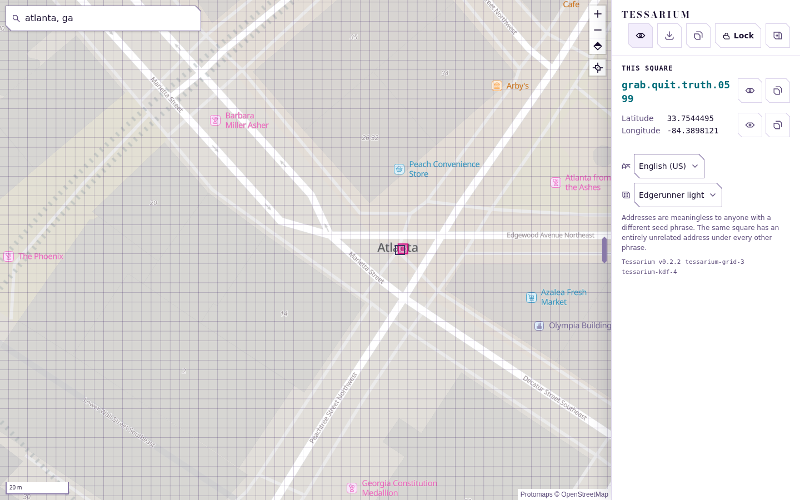
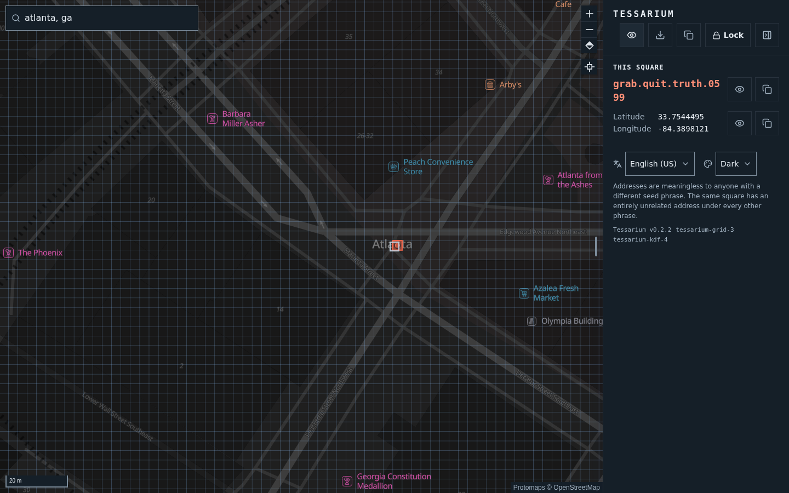
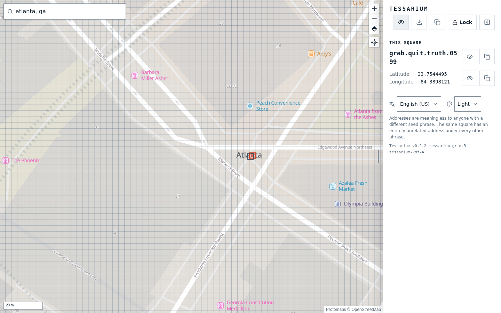
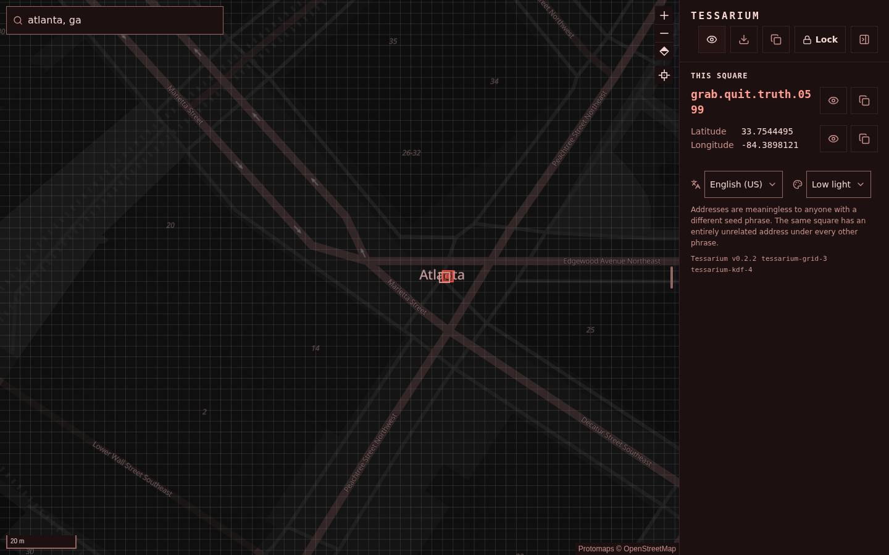
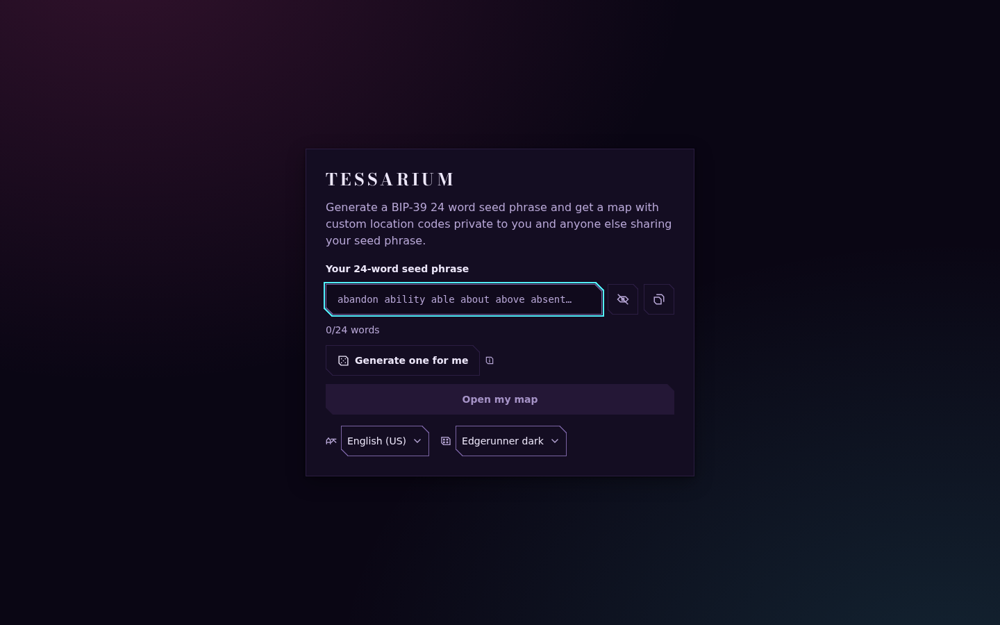
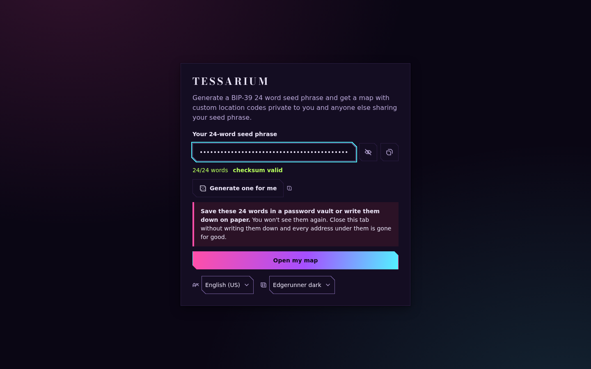
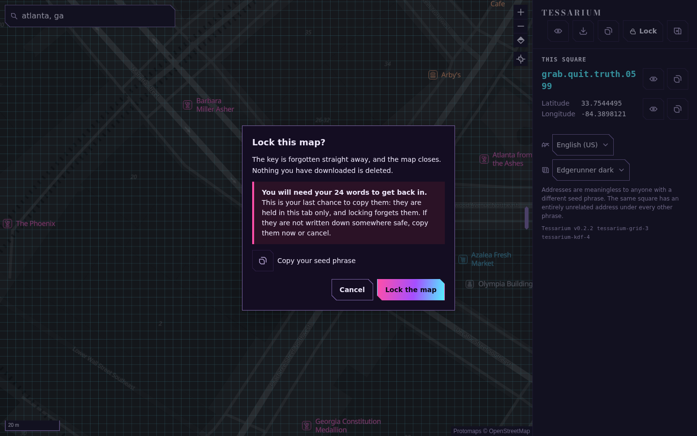
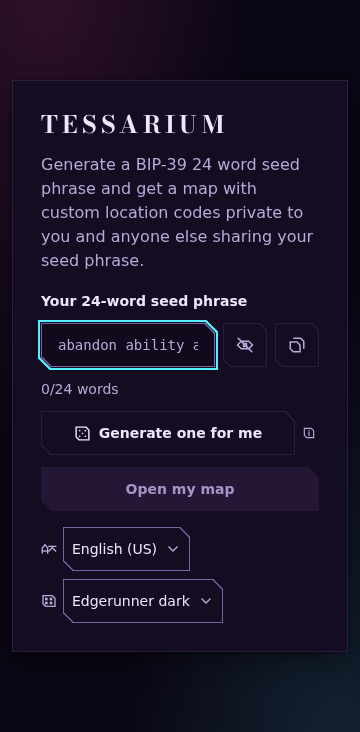
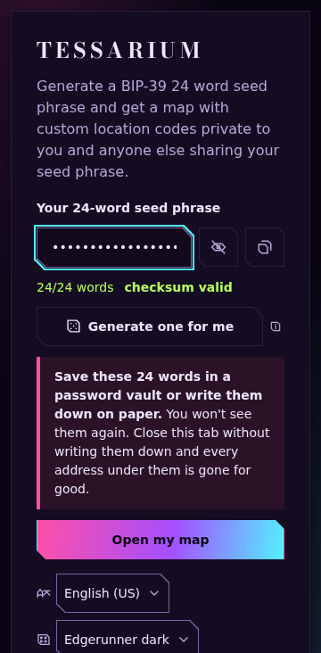

# Tessarium

Generate a BIP-39 24 word seed phrase and get a map with custom location codes private to you and anyone else sharing your seed phrase. 

1. Generate a BIP-39 24 word seed phrase

2. Click on a location on the map

3. Copy the location phrase

4. To share that location with someone else, they'll need your shared seed phrase to find out where it is

5. Anyone looking at the location phrase without your private seed phrase will have no idea where that location is

```
dream.tourist.creek.2703        # this spot, under your seed phrase
pair.social.april.9605          # the exact same spot, under someone else's
```


## Why use this?

This adds a layer of privacy for those who
1. Are already using encryption who want even more security
2. For whatever reason, can't use a trusted secure communication medium to communicate their location
3. Are at risk of their primary communications device being compromised

## What's proven?

Most of the address math here isn't just tested. It's mathematically
proven, using a formal verification programming language that checks every step of the logic rather than trusting that a programmer got it right. That buys three guarantees:

1. Every point on Earth maps to exactly one square and no other
2. Converting an address back always lands in the square it originally came from
3. The scrambling step that makes your map private never gives two different squares the same address, and never leaves a square with no address at all.

## What's not proven?

1. That the scrambling is actually un-guessable without your phrase rests on an
assumption about the hash function it uses (BLAKE2s) behaving
unpredictably. This is the same kind of assumption almost all cryptography rests
on, not a weak point specific to this project.

2. That the tools which turn the proof into a running program did their job
correctly isn't provable either, this is still an area where formal verification doesn't help.

It's checked a different way instead:
independently built versions of the same math are compared against the
proven one on millions of test points, and they agree exactly, every time.

The exact numbers and the reasoning behind them are in
[docs/fe1-security.md](docs/fe1-security.md).

# Building Tessarium

## Prerequisites

**opam** — the OCaml package manager.

→ https://opam.ocaml.org/doc/Install.html

## Everything else

A more detailed install guide will be coming soon

```bash
tools/setup.sh          # installs what's missing if you're running debian
tools/setup.sh --check  # report only, change nothing
eval "$(make env)"      # put it all on PATH
```
## Then build

```bash
tools/bootstrap.sh      # node modules, basemap tiles, first compile
make build              # native binaries and the browser bundle
make ui                 # the web UI
make run                # serve on 127.0.0.1:7373
```

## Test dependencies
```bash
cd ui && pnpm exec playwright install chromium
make test-ui
```

## Verify

```bash
make verify    # prove every F* module (zero admits enforced)
make test      # all five test suites
```

## Run it

### Quick start
```bash
pnpm run dev                 # the whole app at http://localhost:7380
```


```bash
eval "$(make env)"           # puts the toolchain on this terminal's PATH, which `make` needs
pnpm run build               # build the web app and bundle it into the server program
make run                     # starts the app at http://127.0.0.1:7373 and opens your browser
tools/fetch-basemap.sh       # grabs a sample map (central London) on top of the world overview
```

Downloaded maps do not live in the checkout. They go to
`~/.local/share/tessarium/basemap` — the same store an installed copy uses, so
a re-clone or a `git clean` cannot take hundreds of megabytes of maps with it,
and development and an installed app read one set. `TESSARIUM_BASEMAP` points
somewhere else. A checkout that still holds a `basemap/` directory has it moved
there on the next run, rather than fetched again.

`make package` builds a release you can hand to someone else: two small
programs and a map of the whole world, nothing else to install. The world map
is built in at the depth this app ever draws it -- towns and roads everywhere,
about 43 MB -- so it works offline from the first launch and there is nothing
to download for the planet. Street-level detail for wherever you actually are
is downloaded afterward, inside the app.
`tools/fetch-basemap.sh -b min_lon,min_lat,max_lon,max_lat -z 15` grabs
detail for anywhere yourself, pulling only the area you asked for rather
than the whole planet's map data.

## Where your key lives

Your seed phrase never leaves your browser. It's typed into the page and
turned into a key by a background process running inside the browser itself.

The rest of the app only ever sends map coordinates in and gets addresses
back; the key itself never travels anywhere, not even between parts of the
app.

Nothing is saved to your browser's storage, and the app is configured
so it cannot contact any outside server at all, so even a bug in some other
piece of software it depends on has nowhere to send your information.

The local server also offers the same address math as a plain API, for
scripting, but it's switched off unless you turn it on, and the web app
itself never uses it. Turning it on means your seed phrase would travel to
that local program over the network, which most people never need to do.

## How it works

### The grid

Earth is sliced into thin rows, and each row into squares
roughly 3 meters across, about 55.7 trillion squares in total. Rows near
the poles get narrower squares, so every square stays close to the same
real-world size no matter where it is.

### The scramble

Every square has a plain, predictable number. What you
actually see is that number run through a reversible scramble, using your
seed phrase as the key. The same phrase always scrambles the same way, so
your addresses stay consistent; a different phrase scrambles completely
differently, with no overlap between the two.

### The words

The scrambled number is split into pieces, and each piece is
looked up in a list of 2,048 ordinary words, the same list used by
cryptocurrency wallets to turn keys into memorable phrases. Three words and
a number, together, are your address.

## Two choices worth knowing about

**Nearby squares get unrelated addresses.** You can't shorten an address to
get a rougher location, and you can't guess a neighboring square's address
from one you already know. In exchange, if one address leaks, it only
reveals that one 3-meter square, not the area around it.

**Most word combinations don't point anywhere.** Only about two-thirds of
possible addresses are real. That's deliberate: a typo is far more likely to
be rejected outright than to quietly resolve to the wrong place, and on the
rare occasion a typo does resolve to something, it tends to land hundreds of
kilometers away. Tested against nearly 1,300 real typos, not one landed
within 100 km of where it should have.

## Seed phrases

**Use the full 24 words.** 12-word phrases are strong against every computer
that exists today, but a sufficiently powerful quantum computer, if one is
ever built, could weaken them more than is comfortable.

24 words should stay well out of reach even then.

**Generating a fresh seed phrase is always more secure.** The app can tell whether a phrase was typed correctly, but not whether it was
actually random: a phrase you invented yourself can look valid while still
being far easier to guess than a properly generated one. And reusing a
phrase from somewhere else means anyone attacking that other use is also
attacking your map here.

## What it looks like

Five themes, the same square in each. `make screenshots` regenerates every
image on this page from the running app.

| | |
|---|---|
| **Edgerunner dark** — the default | **Edgerunner light** |
|  |  |
| **Dark** | **Light** |
|  |  |
| **Low light** — for reading a phrase off paper in the dark | |
|  | |

Unlocking, and locking again. The phrase is masked throughout: generating one
does not put 24 words on screen, and locking asks before it forgets them.

| Unlock | A generated phrase | Locking |
|---|---|---|
|  |  |  |

On a phone the panel becomes a sheet across the bottom.

| Unlock | A generated phrase |
|---|---|
|  |  |

## Layout

```
design/           the grid's design tool and its output       (permanent)
wordlist/         the 2,048-word list                          (permanent)
fstar/            the proven core
ocaml/            the server, the web app's backend logic, the proof's build output
wasm/             the same core, compiled to run in the browser
ui/               the web app itself, in six languages
tools/            scripts for fetching maps and building packages
vectors/          test cases and their expected answers
js/               a second, independently written implementation, kept only to cross-check the first
roadmap.md            everything still to do
roadmap-progress.md   everything already done
```

## Licence

Apache-2.0.
